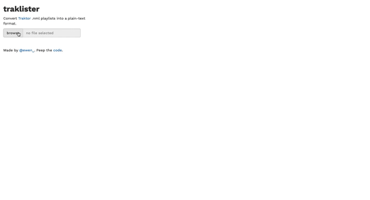

<!-- README.md is generated from README.Rmd. Please edit that file -->

Superceded by [tracklister](https://github.com/ewenme/tracklister).

# traklister



> *Copyright 2019 [Ewen Henderson](http://ewen.io/). Licensed under the
> MIT license.*

A simple app for parsing
[Traktor](https://en.wikipedia.org/wiki/Traktor) .nml playlists into
plain-text formats for using elsewhere.

## Use

Visit [apps.ewen.io/traklister](https://apps.ewen.io/traklister/) to use
`traklister`.

1.  Upload a .nml file exported from Traktor (or [generated as a history
    playlist](https://support.native-instruments.com/hc/en-us/articles/210274225-What-Files-and-Folders-does-TRAKTOR-Install-on-my-System-))
2.  Edit tracklist formatting style (optional)
3.  Export tracklist as .txt, or copy to clipboard

You can also run the app locally, from an R session, by simply running:

``` r
library(shiny)
runGitHub(repo = "ewenme/traklister", subdir = "inst/shiny")
```
